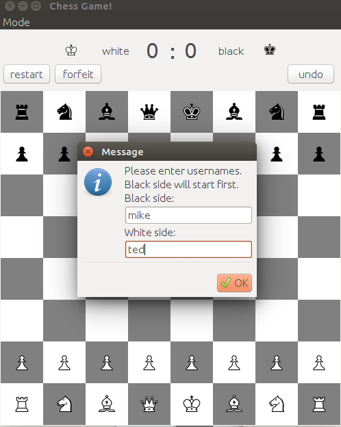
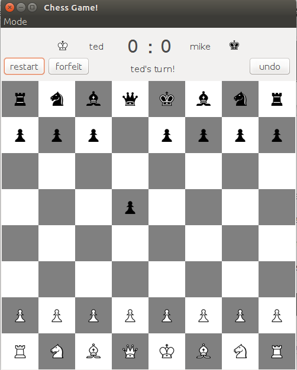
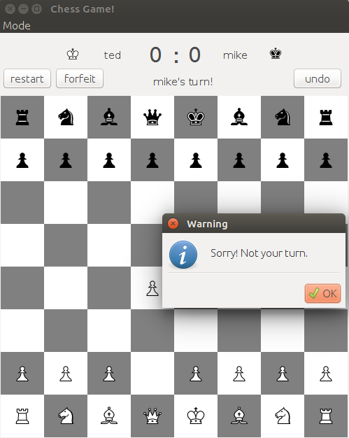
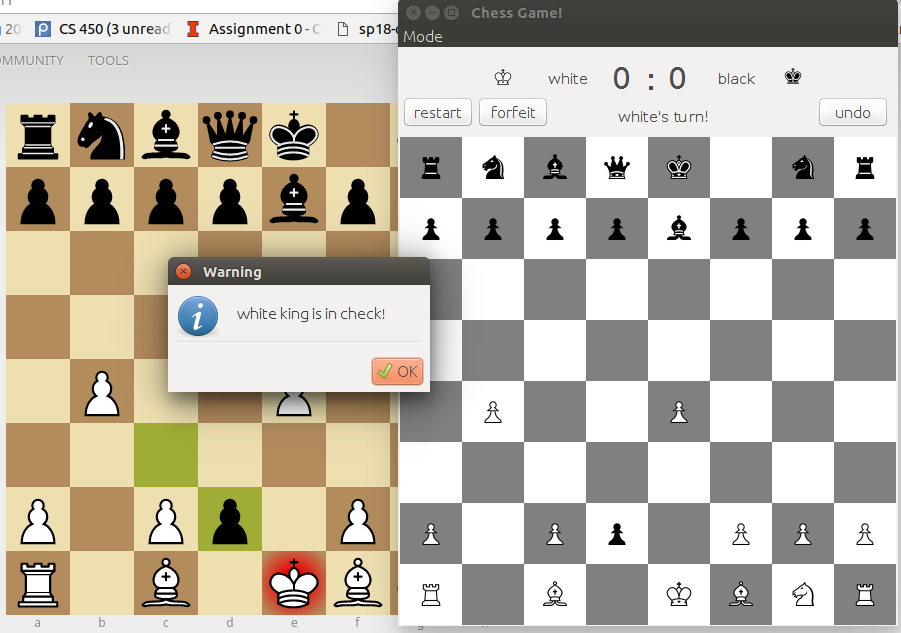
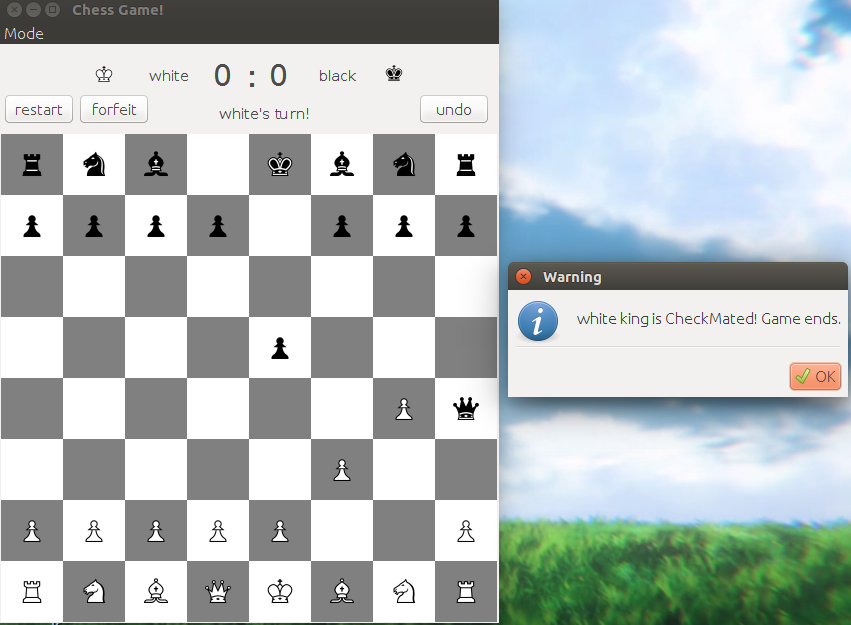
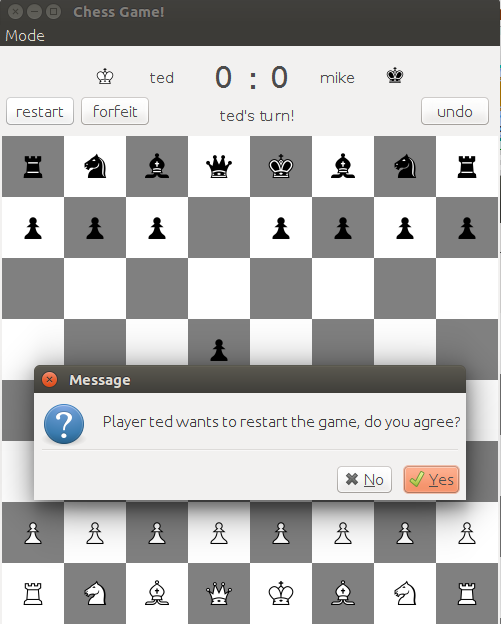
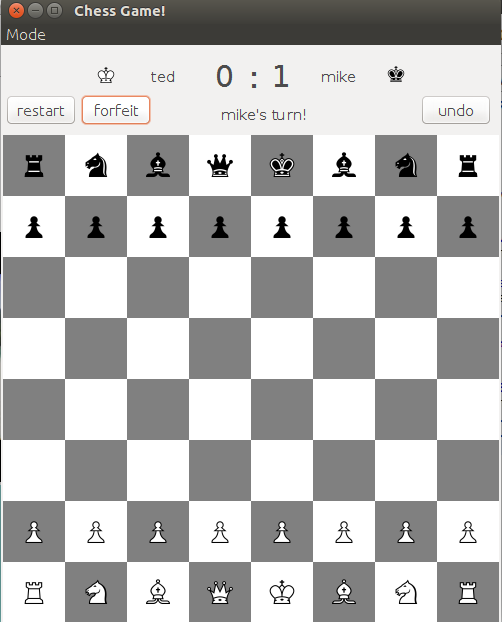
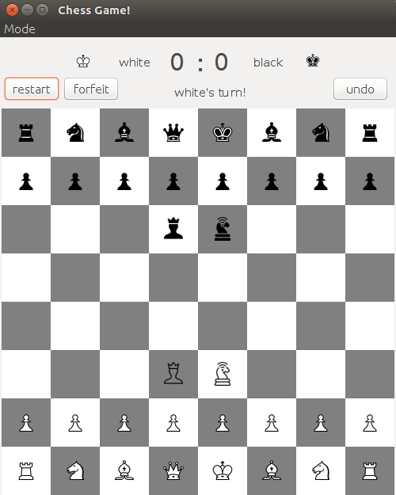

# chess
A chess board game played on 8x8 board. The runnable class is src/chess/Game.java. 

## To Run
Download chess.jar and run
```
java -jar chess.jar
```
## Description

### Starting the Game
When starting the application, you can enter the names of two players.

   

When one player makes the move, the text on top reminds whose turn it is. If the player goes the wrong turn, a message box pops up.


    

### Check and CheckMate
     

### Restarting the Game
If one player wants to restart the game, he can press restart and scores does not change.

 

### Forfeiting the Game
If one player forfeits the game, the opponent's score goes up by one.

 

### Custom Mode
In custom mode, we add two new types of pieces: Amazon and Princess.
  
